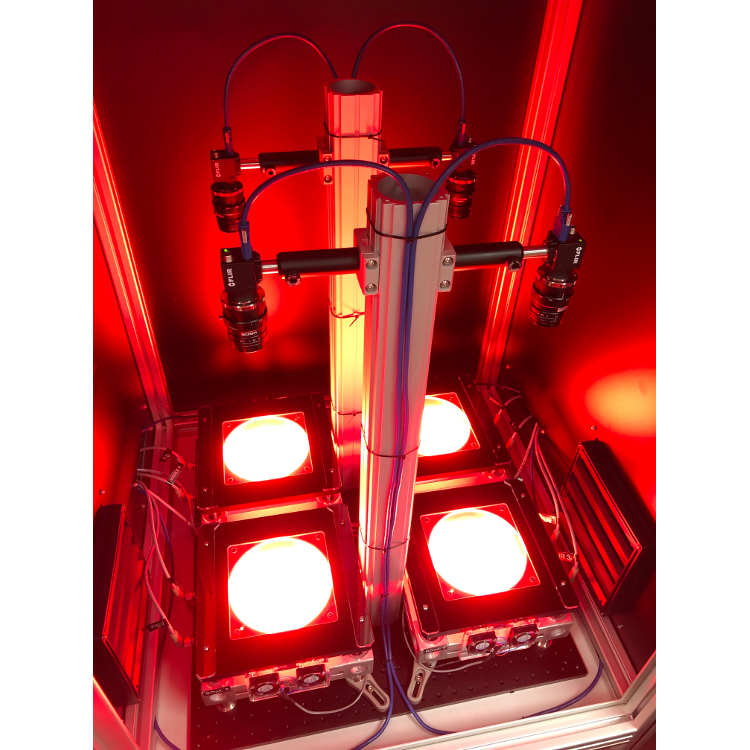
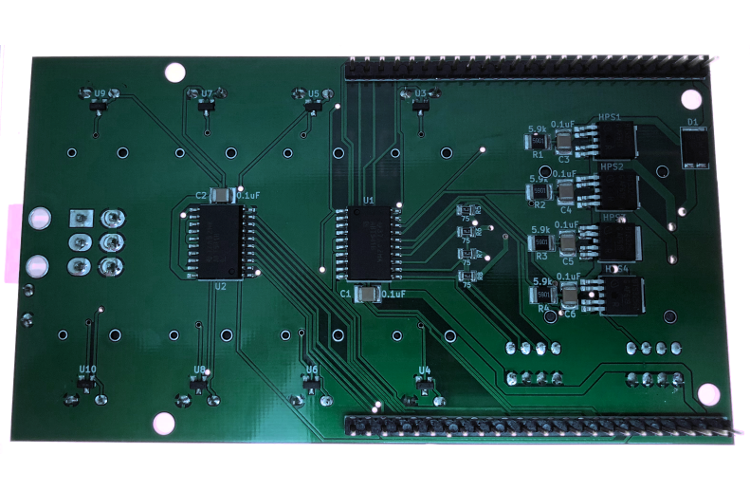
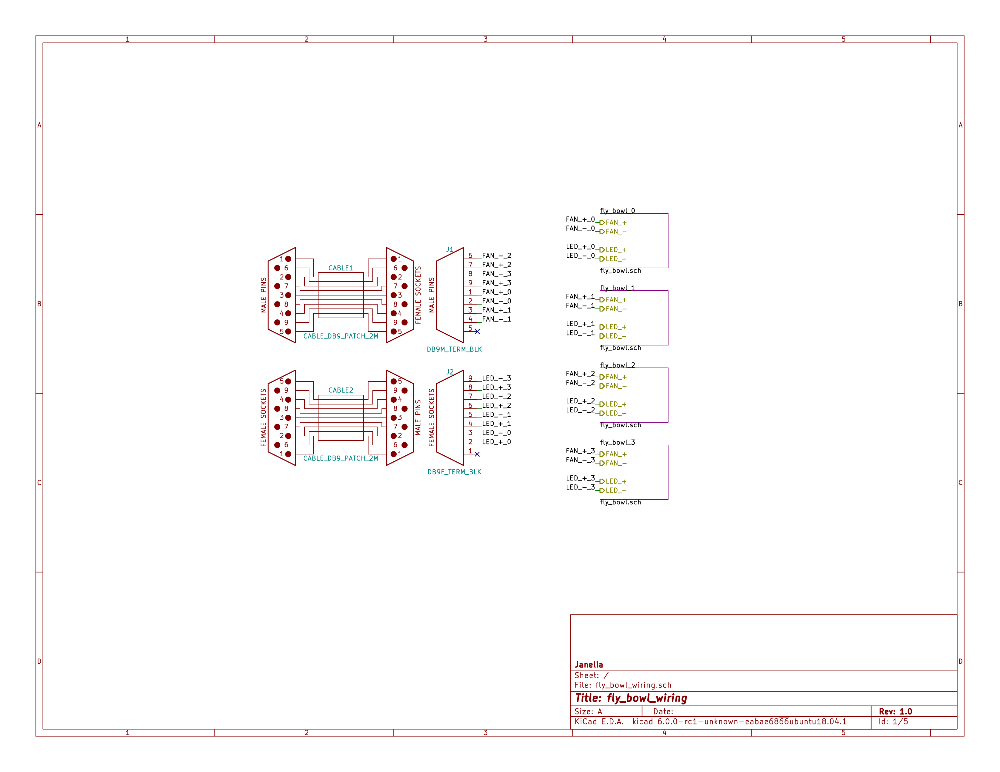

- [Repository Information](#orgc070de8)
  - [Description](#org4eede1c)
- [Images](#org8372e1a)
- [Usage Instructions](#org0c1b53c)
  - [Example Code](#orgcbb483c)
    - [Arduino Serial Monitor](#orgd862351)
    - [Python](#orgd8bd5e3)
    - [Matlab](#orga271b5d)
  - [Example Experiment Step Waveform](#orgb2690c9)
    - [Step Duration](#org36d985b)
    - [Step Delay](#org6b02f28)
    - [Sequence Count](#orgce25b42)
    - [Sequence Off Duration](#org64015c5)
    - [Pulse Count](#org449da1c)
    - [Pulse On Duration](#orgca867f2)
    - [Pulse Period](#org67304b3)
    - [Intensity](#org2fec68a)
- [Build Instructions](#orgc81f32a)
- [Hardware](#org601c397)
  - [backlight\_controller\_5x3](#org5b4f20b)
    - [Repository Information](#org9eb43db)
    - [Images](#org127065b)
    - [Schematic](#org9b2e937)
    - [Gerbers](#org6e68a1c)
    - [Bill of Materials](#org28a25ba)
    - [Supplemental Documentation](#org91b6fdb)
  - [fly\_bowl\_wiring](#org475774d)
    - [Repository Information](#org6c0183d)
    - [Images](#org634cbec)
    - [Schematic](#org29a1f65)
    - [Gerbers](#orgc44ea42)
    - [Bill of Materials](#org9c5f3c2)
    - [Supplemental Documentation](#orga13ea48)
- [Firmware](#org0daa291)
  - [FlyBowlController](#orga6d89fb)
    - [Library Information](#orgcac23a9)
    - [API NAMES](#orgbf09a53)
    - [API GENERAL](#org4f81dc3)
    - [Ancestors](#org1412d01)
    - [Clients](#orgbb8a4f6)
    - [Devices](#orgec3c80f)
    - [More Detailed Modular Device Information](#orga234947)
    - [Installation Instructions](#org85ddde2)


<a id="orgc070de8"></a>

# Repository Information

-   **Name:** fly\_bowl\_controller
-   **Version:** 2.0
-   **License:** BSD, Open-Source Hardware
-   **URL:** <https://github.com/janelia-modular-devices/fly_bowl_controller>
-   **Author:** Peter Polidoro
-   **Email:** peterpolidoro@gmail.com


<a id="org4eede1c"></a>

## Description

This device controls the IR and visible backlights in the fly bowl rig along with the backlight cooling fans and indicator lights.


<a id="org8372e1a"></a>

# Images





<a id="org0c1b53c"></a>

# Usage Instructions


<a id="orgcbb483c"></a>

## Example Code


<a id="orgd862351"></a>

### Arduino Serial Monitor

```sh
?
# {
#   "id": "?",
#   "result": {
#     "device_id": {
#       "name": "fly_bowl_controller",
#       "form_factor": "5x3",
#       "serial_number": 0
#     },
#     "api": {
#       "firmware": [
#         "FlyBowlController"
#       ],
#       "verbosity": "NAMES",
#       "functions": [
#         "setIrBacklightsOnAtIntensity",
#         "setVisibleBacklightsOnAtIntensity",
#         "addVisibleBacklightsPwm",
#         "addExperimentStep",
#         "getExperimentSteps",
#         "getExperimentStatus"
#       ],
#       "parameters": [
#         "pulse_delay",
#         "pulse_period",
#         "pulse_on_duration",
#         "pulse_count",
#         "sequence_off_duration",
#         "sequence_count",
#         "step_delay",
#         "step_duration"
#       ],
#       "properties": [
#         "flyBowlsEnabled"
#       ],
#       "callbacks": [
#         "setIrBacklightsOn",
#         "setIrBacklightsOff",
#         "setVisibleBacklightsOn",
#         "setVisibleBacklightsOff",
#         "removeAllExperimentSteps",
#         "runExperiment",
#         "stopExperiment"
#       ]
#     }
#   }
# }
setPropertiesToDefaults [ALL]
# {
#   "id": "setPropertiesToDefaults",
#   "result": null
# }
flyBowlsEnabled getValue
# {
#   "id": "flyBowlsEnabled",
#   "result": [
#     true,
#     true,
#     true,
#     true
#   ]
# }
flyBowlsEnabled setValue [true,false,true,false]
# {
#   "id": "flyBowlsEnabled",
#   "result": [
#     true,
#     false,
#     true,
#     false
#   ]
# }
irBacklightPowerToIntensityRatio setValue [5.99,5.59,5.41,5.57]
# {
#   "id": "irBacklightPowerToIntensityRatio",
#   "result": [
#     5.990000,
#     5.590000,
#     5.410000,
#     5.570000
#   ]
# }
visibleBacklightPowerToIntensityRatio setValue [14.66,15.87,14.04,14.77]
# {
#   "id": "visibleBacklightPowerToIntensityRatio",
#   "result": [
#     14.660000,
#     15.870000,
#     14.040000,
#     14.770000
#   ]
# }
setIrBacklightsOnAtIntensity 4.5
# {
#   "id": "setIrBacklightsOnAtIntensity",
#   "result": null
# }
removeAllExperimentSteps
# {
#   "id": "removeAllExperimentSteps",
#   "result": null
# }
addExperimentStep ?
# {
#   "id": "addExperimentStep",
#   "result": {
#     "name": "addExperimentStep",
#     "firmware": "FlyBowlController",
#     "parameters": [
#       "intensity",
#       "pulse_period",
#       "pulse_on_duration",
#       "pulse_count",
#       "sequence_off_duration",
#       "sequence_count",
#       "step_delay",
#       "step_duration"
#     ],
#     "result_info": {
#       "type": "long"
#     }
#   }
# }
addExperimentStep 1.71 100 50 5 750 4 1.0 6.0
# {
#   "id": "addExperimentStep",
#   "result": 0
# }
addExperimentStep 2.7 100 50 35 2500 4 0.0 20.0
# {
#   "id": "addExperimentStep",
#   "result": 1
# }
getExperimentSteps
# {
#   "id": "getExperimentSteps",
#   "result": [
#     {
#       "intensity": 1.710000,
#       "pulse_period": 100,
#       "pulse_on_duration": 50,
#       "pulse_count": 5,
#       "sequence_off_duration": 750,
#       "sequence_count": 4,
#       "step_delay": 1.000000,
#       "step_duration": 6.000000
#     },
#     {
#       "intensity": 2.700000,
#       "pulse_period": 100,
#       "pulse_on_duration": 50,
#       "pulse_count": 35,
#       "sequence_off_duration": 2500,
#       "sequence_count": 4,
#       "step_delay": 0.000000,
#       "step_duration": 20.000000
#     }
#   ]
# }
getExperimentStatus
# {
#   "id": "getExperimentStatus",
#   "result": {
#     "state": "EXPERIMENT_NOT_RUNNING",
#     "experiment_step_index": 0,
#     "experiment_step_count": 2,
#     "sequence_index": 0,
#     "sequence_count": 0
#   }
# }
runExperiment
# {
#   "id": "runExperiment",
#   "result": null
# }
getExperimentStatus
# {
#   "id": "getExperimentStatus",
#   "result": {
#     "state": "EXPERIMENT_RUNNING",
#     "experiment_step_index": 0,
#     "experiment_step_count": 2,
#     "sequence_index": 2,
#     "sequence_count": 4
#   }
# }
getExperimentStatus
# {
#   "id": "getExperimentStatus",
#   "result": {
#     "state": "EXPERIMENT_NOT_RUNNING",
#     "experiment_step_index": 0,
#     "experiment_step_count": 2,
#     "sequence_index": 0,
#     "sequence_count": 0
#   }
# }
setVisibleBacklightsOnAtIntensity 4.6
# {
#   "id": "setVisibleBacklightsOnAtIntensity",
#   "result": null
# }
setVisibleBacklightsOff
# {
#   "id": "setVisibleBacklightsOff",
#   "result": null
# }
addVisibleBacklightsPwm ?
# {
#   "id": "addVisibleBacklightsPwm",
#   "result": {
#     "name": "addVisibleBacklightsPwm",
#     "firmware": "FlyBowlController",
#     "parameters": [
#       "intensity",
#       "pulse_delay",
#       "pulse_period",
#       "pulse_on_duration",
#       "pulse_count"
#     ],
#     "result_info": {
#       "type": "long"
#     }
#   }
# }
addVisibleBacklightsPwm 6.0 5000 100 50 1000
# {
#   "id": "addVisibleBacklightsPwm",
#   "result": 0
# }
stopPwm 0
# {
#   "id": "stopPwm",
#   "result": null
# }
setIrBacklightsOff
# {
#   "id": "setIrBacklightsOff",
#   "result": null
# }
```


<a id="orgd8bd5e3"></a>

### Python

```python
from modular_client import ModularClient
dev = ModularClient(timeout=0.1) # Automatically finds device if one available
dev.get_device_id()
# {'name': 'fly_bowl_controller', 'form_factor': '5x3', 'serial_number': 0}
dev.set_properties_to_defaults(['ALL'])
dev.fly_bowls_enabled('getValue')
# [True, True, True, True]
dev.fly_bowls_enabled('setValue',[True,False,True,False])
# [True, False, True, False]
dev.ir_backlight_power_to_intensity_ratio('setValue',[5.99,5.59,5.41,5.57])
# [5.99, 5.59, 5.41, 5.57]
dev.visible_backlight_power_to_intensity_ratio('setValue',[14.66,15.87,14.04,14.77])
# [14.66, 15.87, 14.04, 14.77]
dev.set_ir_backlights_on_at_intensity(4.5) # 4.5 mW/mm^2. Automatically turns fans on too
dev.remove_all_experiment_steps()
intensity = 1.71 # 1.71 mW/mm^2
pulse_period = 100 # 100 ms
pulse_on_duration = 50 # 50 ms
pulse_count = 5
sequence_off_duration = 750 # 750 ms
sequence_count = 4
step_delay = 1.0 # 1.0 s
step_duration = 6.0 # 6.0 s
dev.add_experiment_step(intensity,
                        pulse_period,
                        pulse_on_duration,
                        pulse_count,
                        sequence_off_duration,
                        sequence_count,
                        step_delay,
                        step_duration)
# 0
intensity = 2.7 # 2.7 mW/mm^2
pulse_period = 100 # 100 ms
pulse_on_duration = 50 # 50 ms
pulse_count = 35
sequence_off_duration = 2500 # 2500 ms
sequence_count = 4
step_delay = 0.0 # 0.0 s
step_duration = 20.0 # 20.0 s
dev.add_experiment_step(intensity,
                        pulse_period,
                        pulse_on_duration,
                        pulse_count,
                        sequence_off_duration,
                        sequence_count,
                        step_delay,
                        step_duration)
# 1
dev.get_experiment_steps()
# [{'intensity': 1.71,
#   'pulse_period': 100,
#   'pulse_on_duration': 50,
#   'pulse_count': 5,
#   'sequence_off_duration': 750,
#   'sequence_count': 4,
#   'step_delay': 1.0,
#   'step_duration': 6.0},
#  {'intensity': 2.7,
#   'pulse_period': 100,
#   'pulse_on_duration': 50,
#   'pulse_count': 35,
#   'sequence_off_duration': 2500,
#   'sequence_count': 4,
#   'step_delay': 0.0,
#   'step_duration': 20.0}]
dev.get_experiment_status()
# {'state': 'EXPERIMENT_NOT_RUNNING',
#  'experiment_step_index': 0,
#  'experiment_step_count': 2,
#  'sequence_index': 0,
#  'sequence_count': 0}
dev.run_experiment()
dev.get_experiment_status()
# {'state': 'EXPERIMENT_RUNNING',
#  'experiment_step_index': 0,
#  'experiment_step_count': 2,
#  'sequence_index': 3,
#  'sequence_count': 4}
#
# wait until experiment finishes or dev.stop_experiment()
dev.get_experiment_status()
# {'state': 'EXPERIMENT_NOT_RUNNING',
#  'experiment_step_index': 0,
#  'experiment_step_count': 2,
#  'sequence_index': 0,
#  'sequence_count': 0}
dev.set_visible_backlights_on_at_intensity(4.6) # 4.6 mW/mm^2
dev.set_visible_backlights_off()
dev.add_visible_backlights_pwm('?')
# {'name': 'addVisibleBacklightsPwm',
#  'firmware': 'FlyBowlController',
#  'parameters': ['intensity',
#                 'pulse_delay',
#                 'pulse_period',
#                 'pulse_on_duration',
#                 'pulse_count'],
#  'result_info': {'type': 'long'}}
intensity = 6.0 # 6.0 mW/mm^2
pulse_delay = 1000 # 1000 ms
pulse_period = 100 # 100 ms
pulse_on_duration = 50 # 50 ms
pulse_count = 1000
pwm_index = dev.add_visible_backlights_pwm(intensity,
                                           pulse_delay,
                                           pulse_period,
                                           pulse_on_duration,
                                           pulse_count)
dev.stop_pwm(pwm_index)
dev.set_ir_backlights_off() # Automatically turns fans off too
```


<a id="orga271b5d"></a>

### Matlab

```matlab
% Linux and Mac OS X
ls /dev/tty*
% example Linux serial port
serial_port = '/dev/ttyACM0'
% example Mac OS X serial port
serial_port = '/dev/tty.usbmodem262471'
% Windows
getAvailableComPorts()
% 'COM1'
% 'COM4'
% example Windows serial port
serial_port = 'COM4';
dev = ModularClient(serial_port); % creates a device object
dev.open();                       % opens a serial connection to the device
dev.getDeviceId()
%          name: 'fly_bowl_controller'
%   form_factor: '5x3'
% serial_number: 0
dev.setPropertiesToDefaults({'ALL'});
dev.flyBowlsEnabled('getValue')
% [1]    [1]    [1]    [1]
dev.flyBowlsEnabled('setValue',{true,false,true,false})
% [1]    [0]    [1]    [0]
dev.irBacklightPowerToIntensityRatio('setValue',{5.99,5.59,5.41,5.57})
% [5.99]    [5.59]    [5.41]    [5.57]
dev.visibleBacklightPowerToIntensityRatio('setValue',{14.66,15.87,14.04,14.77})
% [14.66]    [15.87]    [14.04]    [14.77]
dev.setIrBacklightsOnAtIntensity(4.5); % 4.5 mW/mm^2. Automatically turns on fans too
dev.removeAllExperimentSteps();
intensity = 1.71; % 1.71 mW/mm^2
pulse_period = 100; % 100 ms
pulse_on_duration = 50; % 50 ms
pulse_count = 5;
sequence_off_duration = 750; % 750 ms
sequence_count = 4;
step_delay = 1.0; % 1.0 s
step_duration = 6.0; % 6.0 s
dev.addExperimentStep(intensity, ...
                      pulse_period, ...
                      pulse_on_duration, ...
                      pulse_count, ...
                      sequence_off_duration, ...
                      sequence_count, ...
                      step_delay, ...
                      step_duration)
% 0
intensity = 2.7; % 2.7 mW/mm^2
pulse_period = 100; % 100 ms
pulse_on_duration = 50; % 50 ms
pulse_count = 35;
sequence_off_duration = 2500; % 2500 ms
sequence_count = 4;
step_delay = 0.0; % 0.0 s
step_duration = 20.0; % 20.0 s
dev.addExperimentStep(intensity, ...
                      pulse_period, ...
                      pulse_on_duration, ...
                      pulse_count, ...
                      sequence_off_duration, ...
                      sequence_count, ...
                      step_delay, ...
                      step_duration)
% 1
experiment_steps = dev.getExperimentSteps();
experiment_steps{1}
%             intensity: 1.71
%          pulse_period: 100
%     pulse_on_duration: 50
%           pulse_count: 5
% sequence_off_duration: 750
%        sequence_count: 4
%            step_delay: 1
%         step_duration: 6
experiment_steps{2}
%             intensity: 2.7
%          pulse_period: 100
%     pulse_on_duration: 50
%           pulse_count: 35
% sequence_off_duration: 2500
%        sequence_count: 4
%            step_delay: 0
%         step_duration: 20
dev.getExperimentStatus()
%                 state: 'EXPERIMENT_NOT_RUNNING'
% experiment_step_index: 0
% experiment_step_count: 2
%        sequence_index: 0
%        sequence_count: 0
dev.runExperiment()
dev.getExperimentStatus()
%                 state: 'EXPERIMENT_RUNNING'
% experiment_step_index: 0
% experiment_step_count: 2
%        sequence_index: 2
%        sequence_count: 4
%
% wait until experiment finishes or dev.stopExperiment()
dev.getExperimentStatus()
%                 state: 'EXPERIMENT_NOT_RUNNING'
% experiment_step_index: 0
% experiment_step_count: 2
%        sequence_index: 0
%        sequence_count: 0
dev.setVisibleBacklightsOnAtIntensity(4.6); % 4.6 mW/mm^2
dev.setVisibleBacklightsOff();
intensity = 6.0; % 6.0 mW/mm^2
pulse_delay = 1000; % 1000 ms
pulse_period = 100; % 100 ms
pulse_on_duration = 50; % 50 ms
pulse_count = 1000;
pwm_index = dev.addVisibleBacklightsPwm(intensity, ...
                                        pulse_delay, ...
                                        pulse_period, ...
                                        pulse_on_duration, ...
                                        pulse_count);
dev.stopPwm(pwm_index);
dev.setIrBacklightsOff();
dev.close();
clear dev;
```


<a id="orgb2690c9"></a>

## Example Experiment Step Waveform

Yellow waveform shows visible backlight.

Blue waveform shows visible backlight indicator LED.


<a id="org36d985b"></a>

### Step Duration

step\_duration = 6.0 s


<a id="org6b02f28"></a>

### Step Delay

step\_delay = 1.0 s


<a id="orgce25b42"></a>

### Sequence Count

sequence\_count = 4


<a id="org64015c5"></a>

### Sequence Off Duration

sequence\_off\_duration = 750 ms


<a id="org449da1c"></a>

### Pulse Count

pulse\_count = 5


<a id="orgca867f2"></a>

### Pulse On Duration

pulse\_on\_duration = 50 ms


<a id="org67304b3"></a>

### Pulse Period

pulse\_period = 100 ms


<a id="org2fec68a"></a>

### Intensity

intensity = 1.71 mW/mm^2 (power = 25 %)


<a id="orgc81f32a"></a>

# Build Instructions


<a id="org601c397"></a>

# Hardware


<a id="org5b4f20b"></a>

## backlight\_controller\_5x3


<a id="org9eb43db"></a>

### Repository Information

-   **Name:** backlight\_controller\_5x3
-   **Version:** 1.2
-   **License:** Open-Source Hardware
-   **URL:** <https://github.com/janelia-kicad/backlight_controller_5x3>
-   **Author:** Peter Polidoro
-   **Email:** peterpolidoro@gmail.com

1.  Description

    This board controls up to four Smart Vision backlights with IR and visible channels plus additional high and low power channel outputs.


<a id="org127065b"></a>

### Images





<a id="org9b2e937"></a>

### Schematic

[./hardware/backlight\_controller\_5x3/schematic/backlight\_controller\_5x3.pdf](./hardware/backlight_controller_5x3/schematic/backlight_controller_5x3.pdf)


<a id="org6e68a1c"></a>

### Gerbers

Send gerbers zip file to your favorite PCB manufacturer for fabrication.

[./hardware/backlight\_controller\_5x3/gerbers/backlight\_controller\_5x3\_v1.2.zip](./hardware/backlight_controller_5x3/gerbers/backlight_controller_5x3_v1.2.zip)


<a id="org28a25ba"></a>

### Bill of Materials

1.  PCB Parts

    | Item | Reference(s)                                            | Quantity | PartNumber         | Vendor  | Description                                                               |
    |---- |------------------------------------------------------- |-------- |------------------ |------- |------------------------------------------------------------------------- |
    | 1    | C1 C2 C3 C4 C5 C6                                       | 6        | 399-13229-1-ND     | digikey | CAP CER 0.1UF 50V 10% X7R 1210                                            |
    | 2    | D1                                                      | 1        | 568-11697-1-ND     | digikey | DIODE SCHOTTKY 45V 10A CFP15                                              |
    | 3    | HPS1 HPS2 HPS3 HPS4                                     | 4        | BTS3256DAUMA1CT-ND | digikey | IC SWITCH SMART LOWSIDE TO252-5                                           |
    | 4    | J1                                                      | 1        | 1195-4005-1-ND     | digikey | CONN D-SUB RCPT 9POS SMD SOLDER                                           |
    | 5    | J10 J3 J4 J5 J6 J7 J8 J9                                | 8        | 277-10282-1-ND     | digikey | CONN FMALE INSERT 5POS SOLDER                                             |
    | 6    | J2                                                      | 1        | 1195-4006-1-ND     | digikey | CONN D-SUB PLUG 9POS SMD SOLDER                                           |
    | 7    | L1                                                      | 1        | 350-1723-ND        | digikey | LED 2MM 24V VERTICAL RED PC MNT                                           |
    | 8    | L10 L11 L12 L13 L14 L15 L16 L17 L2 L3 L4 L5 L6 L7 L8 L9 | 16       | 350-1726-ND        | digikey | LED 2MM 5V VERTICAL GREEN PC MNT                                          |
    | 9    | MDB1                                                    | 2        | S1011E-25-ND       | digikey | 25 Positions Header Breakaway Connector 0.1in                             |
    | 10   | P1                                                      | 1        | WM1353-ND          | digikey | CONN HEADER 6POS 4.2MM R/A TIN                                            |
    | 11   | R1 R2 R3 R4                                             | 4        | P5.90KAACT-ND      | digikey | RES SMD 5.9k OHM 1% 1/2W 1210                                             |
    | 12   | R5 R6 R7 R8                                             | 4        | P75.0CCT-ND        | digikey | RES SMD 75 OHM 1% 1/8W 0805                                               |
    | 13   | U1 U2                                                   | 2        | 296-14668-1-ND     | digikey | Buffer Non-Inverting 1 Element 8 Bit per Element Push-Pull Output 20-SOIC |
    | 14   | U10 U3 U4 U5 U6 U7 U8 U9                                | 8        | NUD3124LT1GOSCT-ND | digikey | IC INDCT LOAD DRVR AUTO SOT23                                             |

2.  Supplemental Parts

    | Item | Quantity | PartNumber   | Vendor  | Description                    |
    |---- |-------- |------------ |------- |------------------------------ |
    | 1    | 1        | 1866-2122-ND | digikey | AC/DC DESKTOP ADAPTER 24V 280W |
    | 2    | 1        | 1866-5006-ND | digikey | CORD IEC 320-C13 6FT BLACK     |
    | 3    | 8        | 277-10308-ND | digikey | CONN INSERT SHELL PRESS FIT    |

3.  Vendor Parts Lists

    [./hardware/backlight\_controller\_5x3/bom/digikey\_parts.csv](./hardware/backlight_controller_5x3/bom/digikey_parts.csv)

    [./hardware/backlight\_controller\_5x3/bom/supplemental\_digikey\_parts.csv](./hardware/backlight_controller_5x3/bom/supplemental_digikey_parts.csv)


<a id="org91b6fdb"></a>

### Supplemental Documentation

1.  Assembly Instructions

    -   Solder surface mount and through hole components onto the pcb.


<a id="org475774d"></a>

## fly\_bowl\_wiring


<a id="org6c0183d"></a>

### Repository Information

-   **Name:** fly\_bowl\_wiring
-   **Version:** 1.0
-   **License:** Open-Source Hardware
-   **URL:** <https://github.com/janelia-kicad/fly_bowl_wiring>
-   **Author:** Peter Polidoro
-   **Email:** peterpolidoro@gmail.com

1.  Description

    Wiring schematics and documentation for the multiple fly bowl rig.


<a id="org634cbec"></a>

### Images


<a id="org29a1f65"></a>

### Schematic

[./hardware/fly\_bowl\_wiring/schematic/fly\_bowl\_wiring.pdf](./hardware/fly_bowl_wiring/schematic/fly_bowl_wiring.pdf)




<a id="orgc44ea42"></a>

### Gerbers


<a id="org9c5f3c2"></a>

### Bill of Materials

1.  PCB Parts

    | Item | Reference(s)                                                | Quantity | PartNumber     | Vendor            | Description                         |
    |---- |----------------------------------------------------------- |-------- |-------------- |----------------- |----------------------------------- |
    | 1    | BL1 BL2 BL3 BL4                                             | 4        | MOBL\_150x150  | smartvisionlights | Maximum Operating Backlight 150x150 |
    | 2    | CABLE1 CABLE2                                               | 2        | 1195-7211-ND   | digikey           | CABLE ASSY DB09 SHLD BEIGE 2M       |
    | 3    | CABLE10 CABLE11 CABLE13 CABLE14 CABLE4 CABLE5 CABLE7 CABLE8 | 8        | 277-8345-ND    | digikey           | CBL FMALE RA TO MALE 5POS 1.5M      |
    | 4    | CABLE12 CABLE3 CABLE6 CABLE9                                | 4        | GC14333-ND     | digikey           | USB3.0-A-USB3.0-MICRO-B 3M GOLD     |
    | 5    | CAMERA1 CAMERA2 CAMERA3 CAMERA4                             | 4        | FL3-U3-13Y3M-C | flir              | 1280x1024 150 FPS Mono              |
    | 6    | F1 F2 F3 F4 F5 F6 F7 F8                                     | 8        | 381-2367-ND    | digikey           | FAN AXIAL 40X10MM 24VDC WIRE        |
    | 7    | J1                                                          | 1        | 277-2667-ND    | digikey           | CONN DSUB PLUG 9POS STR TERM BLK    |
    | 8    | J2                                                          | 1        | 277-2668-ND    | digikey           | CONN DSUB RCPT 9POS STR TERM BLK    |
    | 9    | L1 L2 L3 L4                                                 | 4        | 475-2864-2-ND  | digikey           | EMITTER IR 860NM 100MA SMD          |

2.  Supplemental Parts

    | Item | Quantity | PartNumber  | Vendor  | Description                  |
    |---- |-------- |----------- |------- |---------------------------- |
    | 1    | 2        | 277-2684-ND | digikey | 9POS DSUB BACKSHELL          |
    | 2    | 2        | 277-2767-ND | digikey | DSUB CAP NUT W/SEAL          |
    | 3    | 2        | 277-2722-ND | digikey | DSUB CAP NUT W/SEAL          |
    | 4    | 2        | A33692-ND   | digikey | CONN D-SUB FEMALE SCREW LOCK |

3.  Vendor Parts Lists

    [./hardware/fly\_bowl\_wiring/bom/digikey\_parts.csv](./hardware/fly_bowl_wiring/bom/digikey_parts.csv)

    [./hardware/fly\_bowl\_wiring/bom/flir\_parts.csv](./hardware/fly_bowl_wiring/bom/flir_parts.csv)

    [./hardware/fly\_bowl\_wiring/bom/smartvisionlights\_parts.csv](./hardware/fly_bowl_wiring/bom/smartvisionlights_parts.csv)

    [./hardware/fly\_bowl\_wiring/bom/supplemental\_digikey\_parts.csv](./hardware/fly_bowl_wiring/bom/supplemental_digikey_parts.csv)


<a id="orga13ea48"></a>

### Supplemental Documentation

1.  Assembly Instructions

    1.  Fly Bowl Numbering

        | Enclosure | Left | Right |
        |--------- |---- |----- |
        | Back      | 0    | 1     |
        | Front     | 2    | 3     |

    2.  Pinout

        | Fly Bowl | Description       | DB9 | Channel | Pin |
        |-------- |----------------- |--- |------- |--- |
        | 0        | IR BACKLIGHT      |     | 8       | 20  |
        | 0        | VISIBLE BACKLIGHT |     | 9       | 21  |
        | 0        | FAN               | 2   | 0       | 2   |
        | 0        | LED               | 2   | 4       | 30  |
        | 1        | IR BACKLIGHT      |     | 10      | 22  |
        | 1        | VISIBLE BACKLIGHT |     | 11      | 23  |
        | 1        | FAN               | 4   | 1       | 5   |
        | 1        | LED               | 4   | 5       | 14  |
        | 2        | IR BACKLIGHT      |     | 12      | 35  |
        | 2        | VISIBLE BACKLIGHT |     | 13      | 36  |
        | 2        | FAN               | 6   | 2       | 6   |
        | 2        | LED               | 6   | 6       | 18  |
        | 3        | IR BACKLIGHT      |     | 14      | 37  |
        | 3        | VISIBLE BACKLIGHT |     | 15      | 38  |
        | 3        | FAN               | 8   | 3       | 29  |
        | 3        | LED               | 8   | 7       | 19  |


<a id="org0daa291"></a>

# Firmware


<a id="orga6d89fb"></a>

## FlyBowlController


<a id="orgcac23a9"></a>

### Library Information

-   **Name:** FlyBowlController
-   **Version:** 2.0.1
-   **License:** BSD
-   **URL:** <https://github.com/janelia-arduino/FlyBowlController>
-   **Author:** Peter Polidoro
-   **Email:** peterpolidoro@gmail.com

1.  Description

    Modular device fly bowl controller library.


<a id="orgbf09a53"></a>

### API NAMES

```js
{
  "id": "getApi",
  "result": {
    "firmware": [
      "FlyBowlController"
    ],
    "verbosity": "NAMES",
    "functions": [
      "setIrBacklightsOnAtPower",
      "setVisibleBacklightsOnAtPower",
      "addVisibleBacklightsPwm",
      "addExperimentStep",
      "getExperimentSteps",
      "getExperimentStatus"
    ],
    "parameters": [
      "pulse_delay",
      "pulse_period",
      "pulse_on_duration",
      "pulse_count",
      "sequence_off_duration",
      "sequence_count",
      "step_delay",
      "step_duration"
    ],
    "properties": [
      "flyBowlsEnabled"
    ],
    "callbacks": [
      "setIrBacklightsOn",
      "setIrBacklightsOff",
      "toggleIrBacklights",
      "setVisibleBacklightsOn",
      "setVisibleBacklightsOff",
      "toggleVisibleBacklights",
      "removeAllExperimentSteps",
      "runExperiment",
      "stopExperiment"
    ]
  }
}
```


<a id="org4f81dc3"></a>

### API GENERAL

<./firmware/FlyBowlController/api/>


<a id="org1412d01"></a>

### Ancestors

<https://github.com/janelia-arduino/ModularServer>

<https://github.com/janelia-arduino/ModularDeviceBase>

<https://github.com/janelia-arduino/DigitalController>

<https://github.com/janelia-arduino/BacklightController>


<a id="orgbb8a4f6"></a>

### Clients


<a id="orgec3c80f"></a>

### Devices

<https://github.com/janelia-modular-devices/modular_device_base>

<https://github.com/janelia-modular-devices/backlight_controller>

<https://github.com/janelia-modular-devices/fly_bowl_controller>


<a id="orga234947"></a>

### More Detailed Modular Device Information

<https://github.com/janelia-modular-devices/modular-devices>


<a id="org85ddde2"></a>

### Installation Instructions

<https://github.com/janelia-arduino/arduino-libraries>
